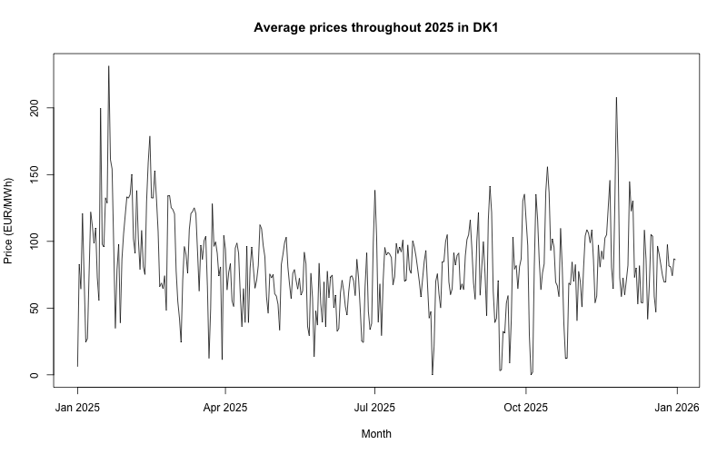
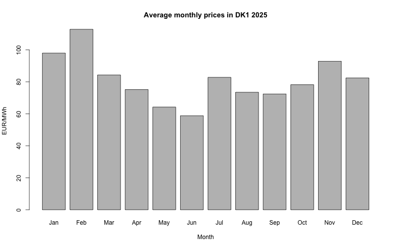
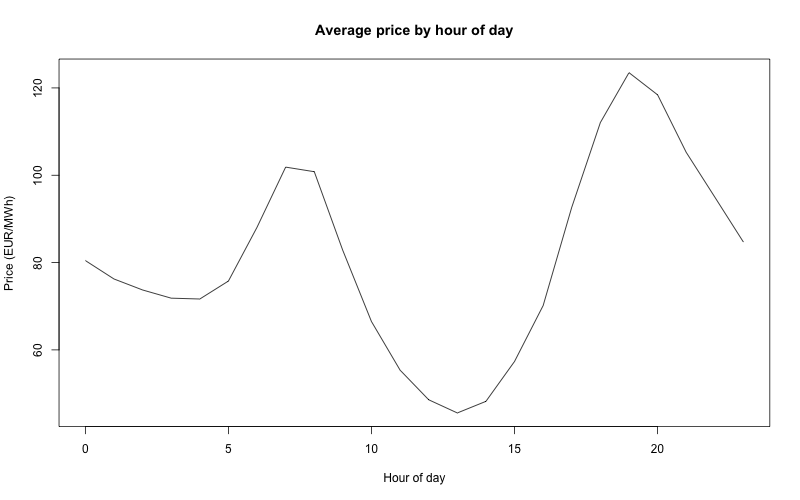
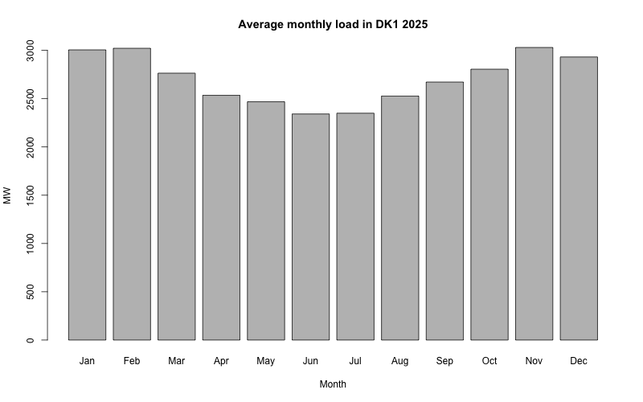

# DK1 Electricity Prices and Load Analysis for 2025

With this project I aim to clean and align public data from the Danish DK1 market. Furthermore, I try to make a few simple, yet relevant plots showing trends in the electricity market.

# --- Objective ---
- Clean and align price data to align with load data prior to analysis
- Examine how electricity prices change over the year 
- Identify intraday price patterns
- Compare seasonal variation in prices and load

# --- Data ---
- Source: ENTSO-E Transparency Platform
- Time period: January–December 2025
- Prices: 15-minute intervals
- Load: Hourly data

# --- Method ---
- Aggregated 15-minute prices into hourly averages
- Merged price and load datasets
- Computed daily and monthly averages
- Visualized trends using simple plots in R

# --- What the data showed ---
- Prices are higher in winter than in summer
- Clear intraday pattern with peaks in morning and evening
- Load follows seasonal demand patterns

# --- Plots ---

